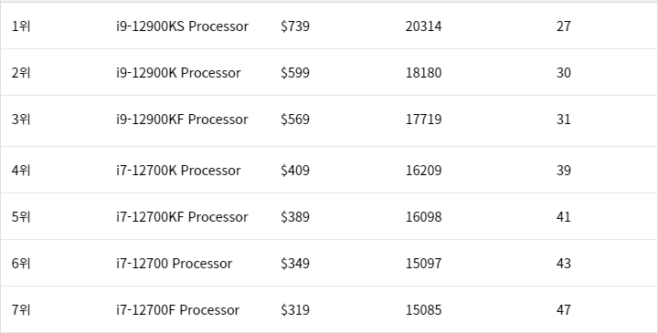
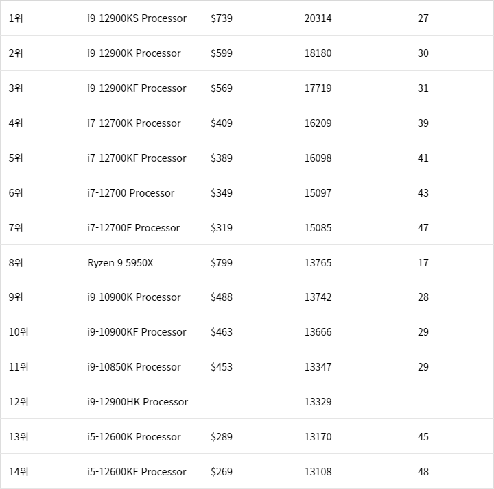

# 14 프로세서는 무조건 빠른게 좋을까?

1. 프로세스란?
2. 프로세서의 성능
3. 현실에서 보는 프로세서
    1. 낮은 온도
        - 🎉 문제점 1. 급속 팽창
        - ⚡ 문제점 2. 전기 저항의 증가
    2. 높은 온도
        - ⚡ 문제점 1. 전기 저항의 감소
        - ⚡ 문제점 2. 전기 저항의 감소에 이어지는 부차적인 문제점
    3. ❌ 가격 가성비
    4. ❌ 가격 가성비
4. 결론

### 프로세서란?

프로세서란, `입력값` 을 해석하고 적절한 `출력값` 을 도출합니다.

구체적으로 보면 다음과 같은 부분을 담당하고 있습니다.

1. 프로세서는 I/O 를 처리합니다.
    1. 산술 입출력
    2. 논리 입출력
2. 프로세서는 OS 를 가동시킵니다.

목적에 맞게 다양한 설계 기법으로 구성된 프로세서들이 컴퓨터에 자리잡고 있습니다.

> 일반적으로 **중앙 처리 장치인 CPU** 와 **마이크로 프로세서** 를 동의어로써 사용하지만, **CPU** 는 개인용 컴퓨터 내부의 프로세서 중 하나일 뿐이므로, 정확하지 않습니다.

### 프로세스의 성능

저는 일반적으로 `성능 = 속도` 로 인지하고 있습니다.

따라서, 어떠한 부분들이 프로세서의 성능을 결정 짓고 향상시키는지 조사했습니다.

> 🤔 잠깐! 
> 프로세서의 구성요소는 다음과 같아요!
> - 프로세서
>    - 1개 이상의 코어

프로세서의 성능이란, `많은 숫자의 일꾼` 과 `빠른 일처리 속도` 로 구분됩니다.

기술적 관점에서는 `많은 코어` 와 `높은 클럭 속도(GHz)` 가 있습니다.

### 현실에서 보는 프로세서

위의 실험의 맹점은 `모두의 환경이 극단적으로 다르다` 라는 부분입니다.

> 금속은 기본적으로 열 민감성이 높습니다.  
> 주변 온도에 민감하게 반응하여, 온도가 빠르게 뜨거워지거나 차가워집니다.

1. 낮은 온도
    - 🎉 문제점 1. 급속 팽창
    - ⚡ 문제점 2. 전기 저항의 증가
2. 높은 온도
    - ⚡ 문제점 1. 전기 저항의 감소
    - ⚡ 문제점 2. 전기 저항의 감소에 이어지는 부차적인 문제점
3. ❌ 가격 가성비
4. ❌ 가격 가성비

#### 🤔 낮은 온도

##### 🎉 문제점 1. 급속 팽창

낮은 온도에서 금속은 축소합니다.

오랜 시간 차가운 환경에 있었던 금속은 열을 받으면 빠르게 팽창합니다.

프로세서와 같은 세밀한 첨단 부품들은 해당 과정에서 파손, 액화, 폭발 등의 현상이 발생할 수 있습니다

##### ⚡ 문제점 2. 전기 저항의 증가

온도가 낮아지면 `전기 저항` 이 높아집니다.

저항이 높아지면 `전류량` 은 낮아지게 됩니다.

대부분의 컴퓨터 부품은 `전기` 를 이용한 `집적 회로, IC` 와 같이 이루어져 있기 떄문에, 성능이 저하되게 됩니다.

#### 🤔 높은 온도

##### ⚡ 문제점 1. 전기 저항의 감소

온도가 높아지면 `전기 저항` 은 낮아지고 `전류량` 은 늘어납니다.

기본적으로 온도는 물질의 내부 분자들이 움직이면서 발생하는 현상이라고 이해해도 되며, 높은 전류가 흐르고 있는 물체는 발열 현상을 가속화 시키게 됩니다.

발열이 높아지게 되면 부품의 파손, 액화, 폭발 등의 현상이 일어날 수 있습니다.

##### ⚡ 문제점 2. 전기 저항의 감소에 이어지는 부차적인 문제점

첨단 기기들은 그 기기가 작고 많은 부품들의 밀집도가 높습니다.

따라서, 프로세서에서 발열된 열기가 배터리 등으로 갈 수 있습니다.

배터리의 발열 및 급속 팽창은 순식간에 해당 기기를 폭발시킬 수 있습니다.

[How Does Temperature Affect The Performance of Computer Components?](https://smallbusiness.chron.com/temperature-affect-performance-computer-components-28197.html)

#### ❌ 가격 가성비

좋은 부품의 가격은 너무나 비쌉니다.

2022년 기준, `인텔` 과 `AMD` 가 출시한 CPU 의 성능 랭킹표를 보면...

1위의 가격이 7위의 가격보다 **231 %** 나 비싼 것을 확인할 수 있습니다.

#### ❌ 성공한 가성비와 실패한 가성비

조금 웃긴 부분은, 기술적 도전은 실패가 많이 발생하며 가성비도 천차만별이라는 점입니다.

동일한 9세대 CPU 여도, 1위와 9위는 가격은 **164.95%**, 성능은 **147. 82%** 입니다.
하지만 7세대인 4위와 9세대인 9위는 가격은 **83.81%**, 성능은 **128.94** 로 가격은 싸고 성능은 높은 부분을 볼 수 있습니다.

실제로 코어의 숫자는 9세대가 많음에도, 7세대가 성능과 가성비 모두가 뛰어난 것입니다.

이렇듯, 실제로는 `설계 기법` 과 `주변 환경` 등의 이유로 성능이 갈리는 부분도 커지게 되는 것입니다.

### 결론

실제로 전자 기기는 다양한 부품이 얽혀 있습니다.

빠른 성능은 곧 많은 발열을 의미하며, 해당 발열을 제어하지 못하면 성능 저하 및 파손의 위험성이 있습니다.

또한 가격적인 부담도 기하급수적으로 커져가며, 해당 부품의 가격 또한 빠르게 작아집니다.

마지막으로 기기의 크기와 특수성에 따라서 프로세서를 내열성이 강한 느린 프로세서를 탑재하기도 해야 할 것입니다.

(예를 들어, 날씨를 감지해서 폭염일때 자동으로 펼쳐지는 파라솔의 프로세서는 속도가 느려야 할 것입니다.)

## References

- [Techopedia / What is processor?](https://www.techopedia.com/definition/28254/processor)
- [Techtarget / What is processor?](https://www.techtarget.com/whatis/definition/processor)
- [HP / What is processor speed?](https://www.hp.com/us-en/shop/tech-takes/what-is-processor-speed) 